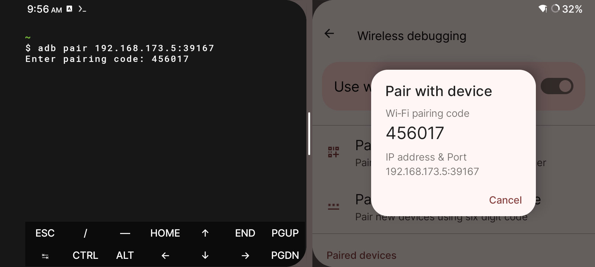
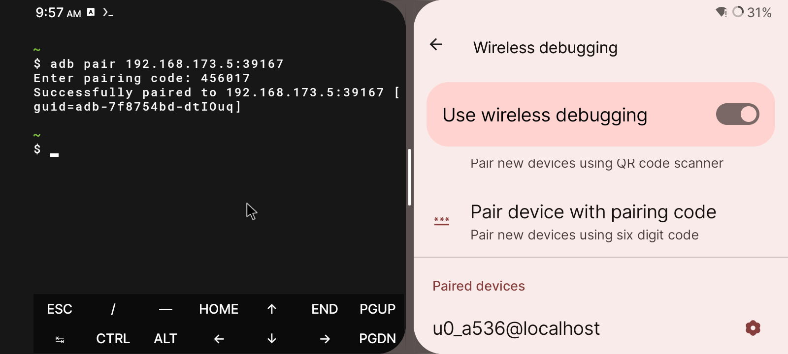
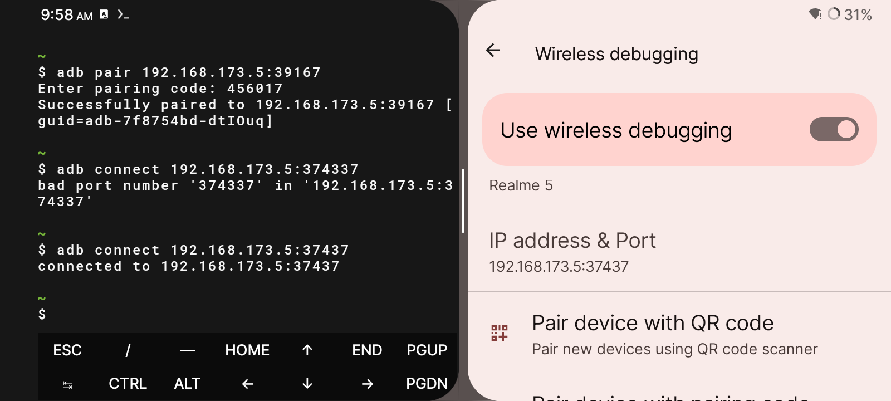
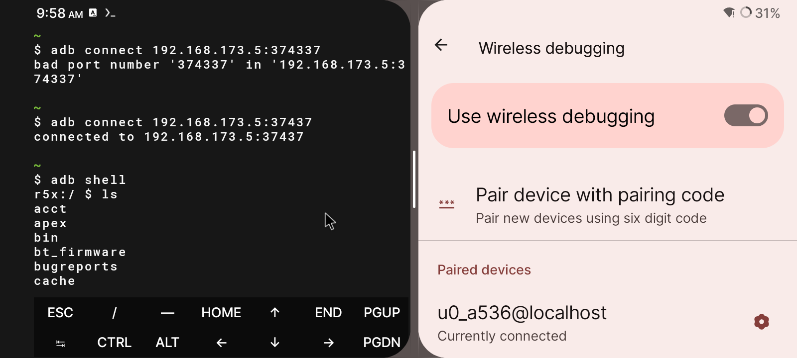
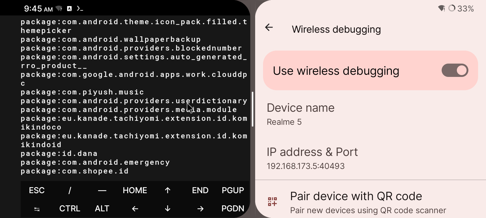
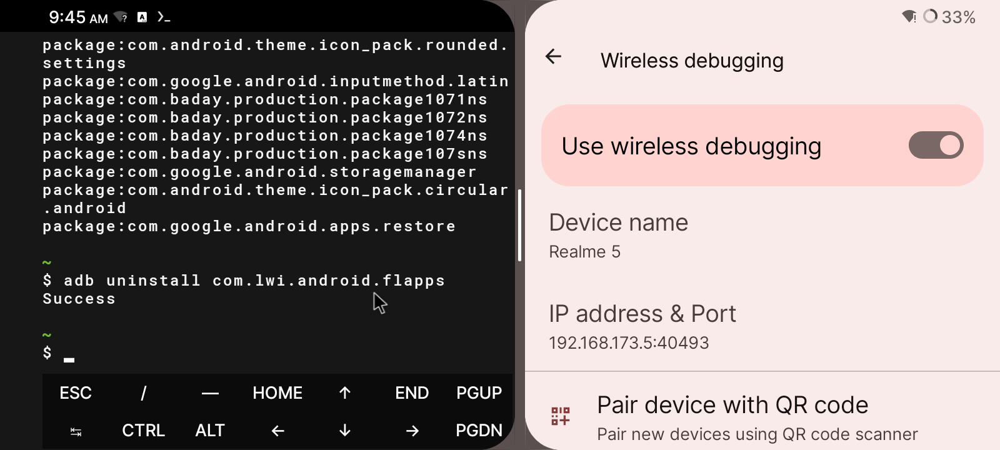
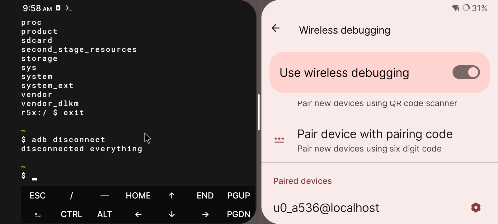

# ADB LOCAL HOST 
connect adb localhost pake termux\
tanpa root dan pc\
kalian harus install aplikasi termux\
[Download Termux](https://github.com/termux/termux-app/releases)
# COMMAND
install android-tools ditermux 
```
pkg install android-tools -y
```
sambungkan hp kalian ke wifi
lalu masuk ke develover settings
dengan cara menekan 7× build id ditentang ponsel
setelah masuk ke developer options kalian cari wireless debugging lalu aktifkan pair device with code

kalo sudah kalian masuk termux 
lalu ketikan ip dan port yg ada di wireless debugging
```
adb pair ipadress&port
contoh 
adb pair 192.168.0.9:44989
```
setelah itu connect ke devicenya liat ip nya di wireless debugging 
```
adb connect ipadress
contoh
adb connect 192.168.0.9
```
kalian bisa uninstall bloatware/ aplikasi bawaan di hp kalian dengan cara 
```
adb uninstall com.exapleAPP
```
untuk liat list package
```
adb shell pm list package 
```

untuk lebih enak liat `package name application` di info app\
kalo gk ada kalian bisa install aplikasi [package name viewer 2.0](https://play.google.com/store/apps/details?id=com.csdroid.pkg)

hati-hati saat menguninstall aplikasi jangan sampai aplikasi penting system terhapus!

jangan lupa kalo sudah kalian disconnect adbnya
```
adb disconnect
```
# SCREENSHOOTS
adb pair


abd connect

adb shell

adb shell list package

adb uninstall 

adb disconnect



